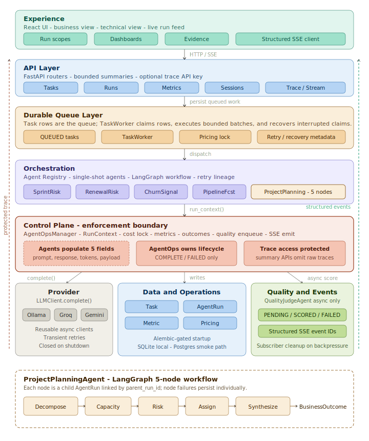

# AgentOps Control Plane

**Author:** Sarala Biswal

> "AI changes who and what does the work. It doesn't eliminate the need to manage it.
> Someone still needs to plan it, prioritize it, measure it, and tie it to financial outcomes."

---

## The Business Problem

Enterprise teams deploying AI agents into production hit the same wall after the demo
stage: the agents run, they produce outputs, and the organization has no coherent answer
to the questions that actually determine whether this is a production system or an
expensive experiment.

- Which agents ran, when, and did they complete or fail?
- What did each run cost, attributed to the decision it was making?
- Is output quality improving or degrading across runs?
- What financial outcome did this agent decision actually drive?

Without answers to these questions, AI agents are not managed systems. They are black
boxes with business consequences that nobody can explain to a CFO or defend in an
engineering post-mortem.

The gap is not the model. The gap is the management layer — observability, cost
attribution, quality measurement, and financial accountability — that was never built.

**AgentOps Control Plane is that management layer.** It traces every agent run,
attributes every dollar of compute cost, scores every output asynchronously, and
connects agent decisions to financial outcomes expressed in the language finance already
uses: risk mitigated, ARR protected, pipeline gap recovered.

---

## Architecture



The platform is organized into six horizontal layers. Each layer has a single
responsibility. No layer reaches across its boundary.

```
┌─────────────────────────────────────────────────────────────────────┐
│  Experience Layer                                                   │
│  React UI  ·  SSE live feed  ·  Business view  ·  Technical view  │
└────────────────────────────┬────────────────────────────────────────┘
                             │ HTTP / SSE
┌────────────────────────────▼────────────────────────────────────────┐
│  API Layer                                                          │
│  FastAPI  ·  Tasks router  ·  Runs router  ·  Metrics router       │
└────────────────────────────┬────────────────────────────────────────┘
                             │ dispatch
┌────────────────────────────▼────────────────────────────────────────┐
│  Orchestration Layer                                                │
│  Agent Registry  ·  Single-shot agents  ·  LangGraph workflow      │
└────────────────────────────┬────────────────────────────────────────┘
                             │ run_context()
┌────────────────────────────▼────────────────────────────────────────┐
│  Control Plane  ◄── the enforcement boundary                        │
│  AgentOpsManager  ·  RunContext  ·  Cost Calculator  ·  Quality Q  │
└──────────┬──────────────────┬──────────────────────┬────────────────┘
           │ complete()       │ writes               │ async score
┌──────────▼────────┐  ┌──────▼───────────────────┐  ┌▼───────────────┐
│  Provider Layer   │  │  Data Layer              │  │  Quality Layer │
│  LLMClient        │  │  Session · Task          │  │  JudgeAgent    │
│  Ollama · Groq    │  │  AgentRun · Metric       │  │  4 dimensions  │
│  Gemini           │  │  BusinessOutcome         │  │  async only    │
└───────────────────┘  └──────────────────────────┘  └────────────────┘
```

### What each layer owns

**Experience** — Two persona-optimized views rendered from the same run data. Business
view leads with financial outcome and risk narrative. Technical view leads with the run
ledger, trace payload, token counts, and the LangGraph node graph. A guided demo mode
walks an audience through the complete platform run: outcome first, then domain
breakdown, evidence, quality scores, and trace replay.

**API** — FastAPI with typed resource routers: Tasks (submit, batch, retry, status),
Runs (filterable observability records), Metrics (cost, quality, latency, throughput).
All agent execution is async. SSE streams `run_started`, `run_completed`, and
`quality_scored` events to the UI in real time.

**Orchestration** — Agent Registry maps agent id to implementation. Single-shot agents
and the LangGraph workflow agent (`ProjectPlanningAgent`) share one dispatch path. Retry
chains preserve lineage via `retry_of` — the relationship between a failed run and its
retry is a first-class data relationship, not a log entry.

**Control Plane** — `AgentOpsManager.run_context()` is the enforcement boundary. Agents
execute inside this context manager and populate exactly five fields. AgentOps owns
everything else. This is not a convention — it is the only path agents have to the
database.

**Provider** — `LLMClient` exposes a single `complete()` method. Ollama, Groq, and
Gemini each have an adapter behind it. Switching providers is a config change. Provider
failures are recorded on `AgentRun` — they are never silent.

**Data** — Seven tables. `AgentRun` is the audit anchor for governance, observability,
retry lineage, quality scores, and financial outcomes. The `Metric` table is shaped for
TimescaleDB: `(ts, metric_name, metric_value, dimensions)`. In production, replace the
SQLite backend with a TimescaleDB hypertable — no application code changes required.

---

## The AgentOps Contract

The contract that makes observability enforced rather than aspirational:

**Agents populate exactly 5 fields:**

| Field | Description |
|---|---|
| `raw_prompt` | Generated prompt sent to the model |
| `prompt_tokens` | Normalized input token count |
| `completion_tokens` | Normalized output token count |
| `raw_response` | Provider output text before parsing |
| `output_payload` | Validated structured JSON consumed by outcomes |

**AgentOps owns everything else:**

| Responsibility | Enforcement |
|---|---|
| RUNNING record written before agent execution | In `run_context()` entry |
| COMPLETE or FAILED written in `finally` | Guaranteed — no abandoned runs |
| `cost_usd` computed from locked pricing | At write time — never recomputed |
| Metrics and SSE emitted from one layer | Not from agent code |
| Quality scoring and outcome attachment | After successful execution only |

Agents do not write to the database. Agents do not manage their own lifecycle.
A run is COMPLETE or FAILED. There is no third state.

---

## Execution Flow

Every agent run — single-shot or multi-node workflow — follows this 7-step governed path:

```
1  Business request    Work enters a scoped session (Project Management or Revenue Management)
2  Task record         FastAPI creates a queued task: domain, agent id, priority, input payload
3  Agent execution     Registry dispatches agent through run_context() — single-shot or LangGraph
4  Provider call       LLMClient.complete() normalizes Ollama / Groq / Gemini response
5  AgentOps trace      Prompt, tokens, cost, status, response → AgentRun (locked at write time)
6  Quality queue       Async judge scores 4 dimensions — never blocks synchronous task execution
7  Financial outcome   Completed run maps to risk reduction, ARR protected, or recoverable quota gap
```

---

## Agents and Business Outcome Formulas

| Agent | Domain | Type | Business Outcome Formula |
|---|---|---|---|
| SprintRiskAgent | Project Management | Single shot | `risk_score × delay_cost_per_week_usd` |
| ResourceAllocationAgent | Project Management | Single shot | `tasks × avg_task_hours × efficiency_gain × hourly_rate` |
| DeliveryForecastAgent | Project Management | Single shot | `committed_revenue × (1 − confidence_score)` |
| ProjectPlanningAgent | Project Management | LangGraph workflow | `committed_revenue × (1 − confidence_score)` |
| RenewalRiskAgent | Revenue Management | Single shot | `account_arr × risk_score × historical_save_rate` |
| ChurnSignalAgent | Revenue Management | Single shot | `account_arr × churn_probability × early_intervention_value` |
| PipelineForecastAgent | Revenue Management | Single shot | `recoverable_gap_usd` |
| QualityJudgeAgent | Platform control | Async judge | Scores: relevance · faithfulness · completeness · actionability |

Every formula produces a dollar-value output persisted to `BusinessOutcome` and linked
to the `AgentRun` that produced it. A complete platform run across all agents produces
a cross-domain outcome ledger. A representative run:

| Agent | Outcome metric | Value | Confidence |
|---|---|---|---|
| SprintRiskAgent | `delivery_risk_mitigated_usd` | $15,000 | 0.70 |
| ProjectPlanningAgent | `pipeline_confidence_gap_usd` | $120,000 | 0.82 |
| RenewalRiskAgent | `renewal_pipeline_protected_usd` | $280,000 | 0.76 |
| PipelineForecastAgent | `recoverable_quota_gap_usd` | $310,000 | 0.84 |

---

## ProjectPlanningAgent: LangGraph Workflow

`ProjectPlanningAgent` accepts a natural language project request and executes a 5-node
LangGraph graph. Each node produces a separate `AgentRun` record linked to the parent
via `parent_run_id`. Node failures are persisted individually. Downstream nodes do not
execute after a failed dependency.

```
node 1 — Decompose    Epics, stories, critical path, story points            612 tokens
node 2 — Capacity     Load, availability, skill gaps, capacity risk           488 tokens
node 3 — Risk         Delivery risk register with likelihood and mitigation   531 tokens
node 4 — Assign       Stories mapped to engineers by skill, load, risk        459 tokens
node 5 — Synthesize   Executive summary, confidence score, revenue exposure   850 tokens
```

The parent run is COMPLETE only when all 5 nodes complete. The Technical view surfaces
the node graph with per-node token counts and status. The Business view surfaces the
final plan and financial exposure.

---

## Observability Data Model

7 tables. Every platform capability traces back to one of them.

| Table | Role |
|---|---|
| Session | Scoped run container. Aggregates cost, quality, and success rate across tasks. |
| Task | Queued work item. Domain, agent id, input payload, priority, status. |
| AgentRun | Core audit record. Prompt, response, tokens, cost, status, model, quality, outcome link. |
| AgentDefinition | Agent catalog. Agent id to implementation, domain, model default, quality rubric. |
| ModelPricing | Cost lock. Pricing rows written at config time and never recomputed at query time. |
| Metric | Time-series: `(ts, metric_name, metric_value, dimensions)`. Covers latency, cost, tokens, quality. |
| BusinessOutcome | Financial impact ledger. One row per successful run, linked to Task and AgentRun. |

`AgentRun` is the audit anchor. Governance, observability, retry lineage, quality scores,
and financial outcomes all link to a single `AgentRun` row. Every outcome is auditable
to its source run.

---

## Operational Control Points

| Control | Enforcement | Status |
|---|---|---|
| RunContext boundary | Agents populate only their 5 fields | Enforced |
| Cost locked at write time | Historical cost is fact, not estimate | Enforced |
| Provider readiness | Model tag resolution prevents silent failures | Observed |
| Quality async only | Judge never blocks synchronous task execution | Async |
| Retry lineage | `retry_of` preserves relationship to original failed run | Linked |
| SSE event stream | `run_started`, `run_completed`, `quality_scored` on every transition | Live |
| Stale recovery | Stranded RUNNING records marked FAILED by sweep process | Guardrail |
| Backpressure cleanup | Stalled SSE subscribers removed automatically | Guardrail |

---

## Run Scope Model

Three execution scopes, selectable before each run:

**Complete Platform** — All 7 business agents across both domains. Results roll into a
cross-domain executive summary with unified outcome ledger and ROI calculation.

**Project Management** — 4 agents: SprintRiskAgent, ResourceAllocationAgent,
DeliveryForecastAgent, ProjectPlanningAgent. Scoped to delivery risk and planning exposure.

**Revenue Management** — 3 agents: RenewalRiskAgent, ChurnSignalAgent,
PipelineForecastAgent. Scoped to renewal risk, churn signals, and late-quarter pipeline gaps.

`QualityJudgeAgent` is a platform control — not a selectable domain run. It appears in
the Governance view, not the scope selector.

---

## Technology Stack

| Component | Technology |
|---|---|
| API | FastAPI · async SQLAlchemy · typed resource routers |
| Database | SQLite (TimescaleDB-replaceable — write interface identical by design) |
| LLM providers | Ollama (default) · Groq · Gemini — normalized through `LLMClient.complete()` |
| Workflow agent | LangGraph 5-node graph with parent-child run records |
| Frontend | React 18 · Vite · TypeScript · Recharts · Tailwind CSS |
| Live feed | Server-Sent Events — run and quality events streamed in real time |
| Experiment tracking | MLflow |

---

## Quick Start

```bash
cd backend
make install
make migrate
make seed
make dev
```

API: `http://localhost:8000` — Frontend: `http://localhost:5173`

Full developer documentation — code flow, AgentOps contract internals, how to add a
new agent, pricing configuration, and SSE subscription model — is at
[docs/developer-guide.md](docs/developer-guide.md).

---

## Design Principles

**The management layer is the product.** Most teams treat observability as an
afterthought bolted onto agents that already run. This platform inverts that: the
control plane is the foundation. Agents are plugged into it.

**Financial accountability is a first-class output.** Every agent decision produces a
dollar-value consequence linked to its run record. If an agent output cannot be expressed
as a business outcome, it should not be in production.

**Separation of agent logic from platform concerns is enforced, not requested.** The
agent contract is a boundary, not a convention. Agents that violate it cannot run.

**Cost is locked at write time.** Historical cost records are facts. Pricing changes do
not retroactively alter what a past run cost.

**Failure is always visible.** A run is COMPLETE or FAILED. The `finally` block in
`run_context()` is a guarantee, not a best practice.