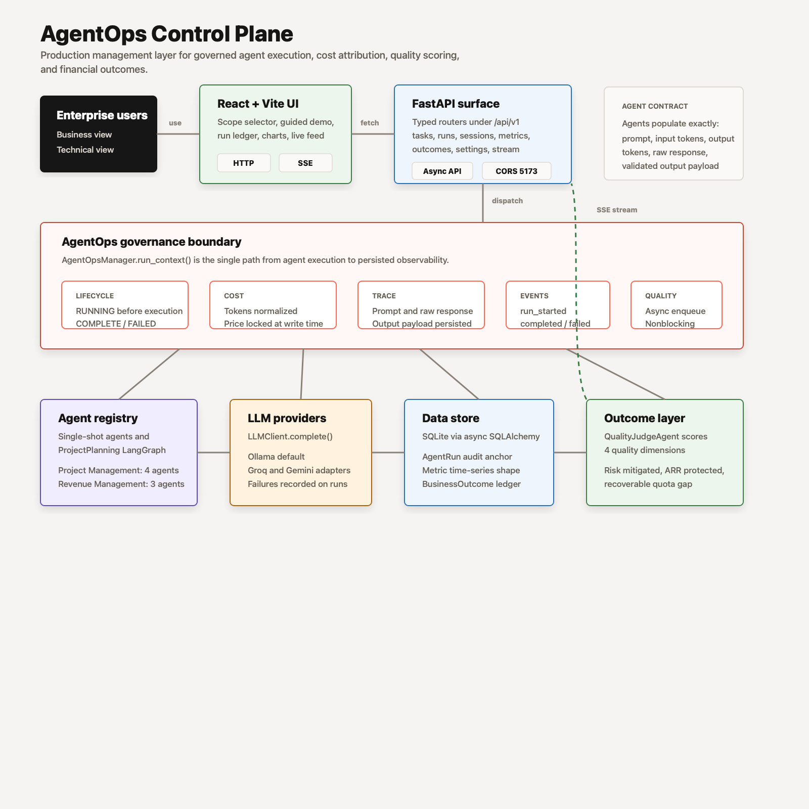
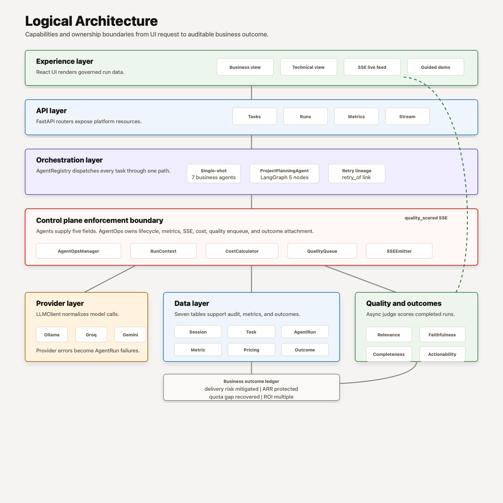
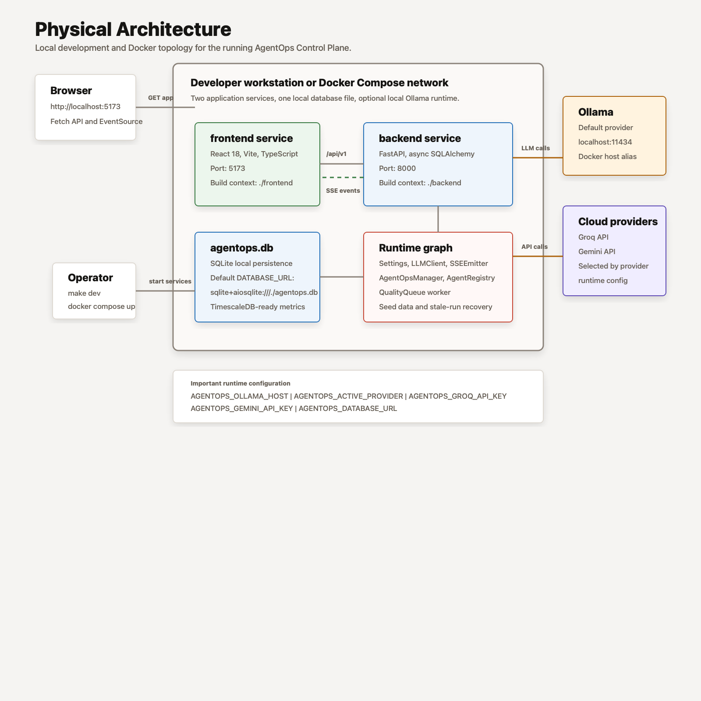

# AgentOps Control Plane Developer Guide

**Author:** Sarala Biswal

This guide explains how the code is organized, how a run flows through the
platform, and where to make changes when extending the app.

## Architecture Diagrams

The project keeps rendered architecture assets under `docs/assets/`.



**System architecture** — end-to-end request, durable task execution,
governance, provider, data, quality, trace access, and outcome flow.



**Logical architecture** — ownership boundaries across experience, API,
durable queue, orchestration, control plane, observability, provider, data, and
operations layers.



**Physical architecture** — local development and Docker runtime topology,
ports, service boundaries, in-process workers, database, migrations, provider
clients, and validation commands.

## System Flow

The application is split into experience, API, durable queue, orchestration,
control-plane, provider, data, and observability layers. A normal run flows
through the system like this:

1. The React shell in `frontend/src/App.tsx` selects a run scope: complete
   platform, Project Management, Revenue Management, or a single agent.
2. The UI creates or reuses an active session through `useSession()` and submits
   one or more tasks through `api.tasks.batch()`.
3. `backend/app/routers/tasks.py` validates each agent, resolves provider/model
   pricing, and writes durable `QUEUED` `Task` rows. The API request does not
   directly execute the agent.
4. `backend/app/agentops/task_queue.py` claims queued tasks through
   `TaskWorker`, preserves retry/pricing metadata, and recovers interrupted
   claims on startup.
5. `backend/app/agents/registry.py` maps persisted agent IDs to executable agent
   classes.
6. Each agent runs inside `AgentOpsManager.run_context()` in
   `backend/app/agentops/manager.py`. This is the control-plane boundary that
   records run status, prompt/response payloads, token counts, cost, metrics,
   outcomes, and SSE events.
7. `backend/app/llm/client.py` resolves the active provider and model. Ollama is
   the default local provider; Groq and Gemini adapters are available when
   configured. Provider adapters reuse async HTTP clients, retry transient
   failures, and close during app shutdown.
8. Completed runs write business impact through
   `backend/app/outcomes/calculator.py` and enqueue quality scoring through
   `QualityQueue`. Quality scoring persists `PENDING`, `SCORED`, or `FAILED`
   status with attempts and errors.
9. The frontend refreshes run state through structured SSE and polling, then
   presents business outcomes, bounded run summaries, cost, quality, and run
   progress. Raw prompt/response traces are available through the protected
   `/runs/{run_id}/trace` endpoint.

## Important Files

| Area | File | Purpose |
|---|---|---|
| App shell | `frontend/src/App.tsx` | Persona views, run scopes, scenario inputs, run progress |
| API client | `frontend/src/api/client.ts` | Browser-to-FastAPI request wrapper |
| API entry | `backend/app/main.py` | FastAPI app, migration-gated startup, shared runtime services |
| Task API | `backend/app/routers/tasks.py` | Task submission, batch creation, retry records |
| Task worker | `backend/app/agentops/task_queue.py` | Durable task claiming, execution, recovery |
| Agent catalog | `backend/app/agents/registry.py` | Maps agent IDs to implementations |
| Run boundary | `backend/app/agentops/manager.py` | Trace, metrics, cost, outcomes, SSE, quality enqueue |
| Stream layer | `backend/app/routers/stream.py` | Structured SSE serialization and session filtering |
| Trace auth | `backend/app/routers/deps.py` | Optional API-key guard for raw trace access |
| Provider layer | `backend/app/llm/client.py` | Active provider/model routing and provider shutdown |
| Costing | `backend/app/agentops/cost_calculator.py` | Token-to-cost calculation from pricing rows |
| Outcomes | `backend/app/outcomes/calculator.py` | Business value formulas by agent |
| Pricing seed | `backend/app/seed/pricing.py` | Input/output model prices, including elevated local demo pricing |
| Migrations | `backend/app/core/migrations.py` | Alembic head validation at startup |
| Postgres smoke | `backend/app/core/postgres_validation.py` | Optional Postgres migration validation command |

## Run Modes

- **Complete Platform:** runs all Project Management and Revenue Management
  agents.
- **Project Management:** runs sprint risk, resource allocation, delivery
  forecast, and the ProjectPlanning workflow.
- **Revenue Management:** runs renewal risk, churn signal, and pipeline forecast.
- **Single Agent:** validates one selected agent against the active domain
  scenario.

The ProjectPlanning workflow is the only multi-node agent. The UI surfaces its
user input directly in the Business View run console, then the backend executes
the workflow from decomposition through synthesis.

## Code Flow By Run Mode

The frontend uses the same execution function for platform, domain, and
single-agent runs: `submitAgents()` in `frontend/src/App.tsx`. The difference is
the list of agent IDs and the scenario payloads passed into the batch request.

### A. Complete Platform Run

A complete platform run starts when `scope === "platform"` and the user clicks
the primary run action.

1. `runSelectedScope()` reads `scopeAgentIds.platform`.

   Input:

   ```ts
   [
     "agent-sprint-risk",
     "agent-resource-alloc",
     "agent-delivery-forecast",
     "agent-project-planning",
     "agent-renewal-risk",
     "agent-churn-signal",
     "agent-pipeline-forecast",
   ]
   ```

   Output: `submitAgents(agentIds, "Complete Platform", message)` is called.

2. `submitAgents()` calls `ensureSession()`.

   Input: current React `session` state.

   Output: an existing `Session`, or a new one created by:

   ```http
   POST /api/v1/sessions
   Content-Type: application/json

   {"name":"Demo Session <time>"}
   ```

   Response shape:

   ```json
   {
     "id": "session-id",
     "name": "Demo Session 10:15:00 PM",
     "status": "ACTIVE",
     "total_cost_usd": 0,
     "total_tasks": 0,
     "success_rate": 0,
     "avg_quality_score": 0
   }
   ```

3. `submitAgents()` builds one `TaskSubmit` per agent.

   Input: active Project Management scenario, active Revenue Management
   scenario, editable ProjectPlanning input, and the session ID.

   Output:

   ```json
   {
     "tasks": [
       {
         "agent_id": "agent-sprint-risk",
         "session_id": "session-id",
         "input_payload": {"sprint_name": "..."},
         "priority": "HIGH"
       },
       {
         "agent_id": "agent-renewal-risk",
         "session_id": "session-id",
         "input_payload": {"account_name": "..."},
         "priority": "HIGH"
       }
     ]
   }
   ```

   The real request contains seven tasks: four Project Management tasks and
   three Revenue Management tasks.

4. `api.tasks.batch()` sends the durable batch request.

   Request:

   ```http
   POST /api/v1/tasks/batch
   Content-Type: application/json
   ```

   Backend call path:

   ```text
   frontend/src/api/client.ts
   -> backend/app/routers/tasks.py::submit_batch()
   -> _pricing_id()
   -> INSERT Task rows with status QUEUED
   ```

   Backend input: each task needs `agent_id`, `session_id`, `input_payload`, and
   optional `priority`.

   Backend output: a list of persisted task rows:

   ```json
   [
     {
       "id": "task-id",
       "session_id": "session-id",
       "agent_id": "agent-sprint-risk",
       "domain": "PROJECT_DELIVERY",
       "task_type": "sprint_risk_assessment",
       "input_payload": {"sprint_name": "..."},
       "priority": "HIGH",
       "status": "QUEUED",
       "submitted_at": "2026-06-12T05:00:00",
       "started_at": null,
       "completed_at": null
     }
   ]
   ```

5. `submitAgents()` stores frontend progress state.

   Input: returned task IDs and payloads grouped by agent.

   Output: `activeRun` state with `agentIds`, `taskIds`, `payloads`,
   `scenarioTitles`, and `startedAt`. This state drives the run progress bar and
   payload preview.

6. `TaskWorker` claims and executes queued tasks.

   Backend call path:

   ```text
   backend/app/agentops/task_queue.py::TaskWorker.process_once()
   -> _claim_queued_tasks()
   -> execute_tasks_concurrently()
   -> execute_task()
   -> AgentRegistry.get(agent_id).run()
   ```

   Input: `Task` rows with `status = QUEUED` and a resolved
   `model_pricing_id`.

   Output: claimed tasks move to `RUNNING` with `started_at`, `claimed_at`, and
   incremented `attempt_count`.

7. Each agent enters `AgentOpsManager.run_context()`.

   Input:

   ```text
   task_id, agent_id, session_id, active model, model_pricing_id, run_type
   ```

   Output before the LLM call: an `AgentRun` row with `status = RUNNING`, plus a
   structured `run_started` SSE event.

8. The agent builds a prompt, calls the provider, and parses output.

   Backend call path for single-shot agents:

   ```text
   backend/app/agents/base.py::BaseAgent.run()
   -> build_prompt(task.input_payload)
   -> LLMClient.complete(prompt)
   -> parse_output(raw_response)
   ```

   Input: agent-specific payload from the selected demo scenario.

   Output: parsed `output_payload`, token counts, model name, raw prompt, and raw
   response stored on the run context.

9. `AgentOpsManager` finalizes the run.

   Output:

   ```text
   AgentRun: COMPLETE or FAILED
   Task: COMPLETE or FAILED
   Metric rows: latency_ms, cost_usd, prompt_tokens, completion_tokens
   BusinessOutcome: written for completed runs with usable output
   SSE: run_completed
   QualityQueue: queued for asynchronous scoring
   ```

10. The UI refreshes evidence.

    Calls:

    ```http
    GET /api/v1/runs?session_id=<session-id>
    GET /api/v1/outcomes/session/<session-id>
    ```

    Output: updated run evidence, domain breakdown, cost, quality, and business
    outcome totals.

### B. Project Management Domain Run

A Project Management run uses the same pipeline with a smaller agent set and
only Project Management scenario inputs.

1. `runSelectedScope()` reads `scopeAgentIds.project`.

   Input:

   ```ts
   [
     "agent-sprint-risk",
     "agent-resource-alloc",
     "agent-delivery-forecast",
     "agent-project-planning",
   ]
   ```

   Output: `submitAgents(agentIds, "Project Management", message)` is called.

2. `submitAgents()` resolves payloads through `payloadForAgent(agentId)`.

   Input by agent:

   | Agent | Payload source |
   |---|---|
   | `agent-sprint-risk` | `currentProjectScenario.payloads["agent-sprint-risk"]` |
   | `agent-resource-alloc` | `currentProjectScenario.payloads["agent-resource-alloc"]` |
   | `agent-delivery-forecast` | `currentProjectScenario.payloads["agent-delivery-forecast"]` |
   | `agent-project-planning` | editable `projectPlanningInput` converted by `projectPlanningPayloadFrom()` |

   Output: four `TaskSubmit` objects with the same `session_id` and
   `priority = "HIGH"`.

3. `POST /api/v1/tasks/batch` persists four durable task rows.

   Backend input:

   ```json
   {
     "tasks": [
       {"agent_id": "agent-sprint-risk", "session_id": "session-id", "input_payload": {}, "priority": "HIGH"},
       {"agent_id": "agent-resource-alloc", "session_id": "session-id", "input_payload": {}, "priority": "HIGH"},
       {"agent_id": "agent-delivery-forecast", "session_id": "session-id", "input_payload": {}, "priority": "HIGH"},
       {"agent_id": "agent-project-planning", "session_id": "session-id", "input_payload": {}, "priority": "HIGH"}
     ]
   }
   ```

   Backend output: four `TaskSchema` rows in `QUEUED` status.

4. `TaskWorker` executes the three single-shot Project Management agents.

   Input:

   ```text
   sprint risk payload
   resource allocation payload
   delivery forecast payload
   ```

   Output:

   ```text
   one AgentRun per task
   one parsed output payload per agent
   task statuses updated to COMPLETE or FAILED
   business outcomes written for completed outputs
   ```

5. `ProjectPlanningAgent` executes as a LangGraph workflow.

   Input: editable project-planning payload from the UI.

   Output:

   ```text
   one WORKFLOW_PARENT AgentRun
   child AgentRun records for Decompose, Capacity, Risk, Assign, and Synthesize
   final synthesized project plan in output_payload
   BusinessOutcome linked to the parent run when complete
   ```

6. The UI updates Project Management evidence.

   Calls:

   ```http
   GET /api/v1/runs?session_id=<session-id>
   GET /api/v1/outcomes/session/<session-id>
   ```

   Output: Project Management run progress, sprint risk evidence, allocation
   evidence, delivery forecast evidence, workflow trace summary, quality scores,
   cost, and financial impact.

### C. Revenue Management Domain Run

A Revenue Management run follows the same batch submission and task-worker
pipeline, but it selects only Revenue Ops agents and only Revenue Management
scenario inputs.

1. `runSelectedScope()` reads `scopeAgentIds.revenue`.

   Input:

   ```ts
   [
     "agent-renewal-risk",
     "agent-churn-signal",
     "agent-pipeline-forecast",
   ]
   ```

   Output: `submitAgents(agentIds, "Revenue Management", message)` is called.

2. `submitAgents()` resolves payloads through `payloadForAgent(agentId)`.

   Input by agent:

   | Agent | Payload source |
   |---|---|
   | `agent-renewal-risk` | `currentRevenueScenario.payloads["agent-renewal-risk"]` |
   | `agent-churn-signal` | `currentRevenueScenario.payloads["agent-churn-signal"]` |
   | `agent-pipeline-forecast` | `currentRevenueScenario.payloads["agent-pipeline-forecast"]` |

   Output: three `TaskSubmit` objects with the same `session_id` and
   `priority = "HIGH"`.

3. `POST /api/v1/tasks/batch` persists three durable task rows.

   Backend input:

   ```json
   {
     "tasks": [
       {"agent_id": "agent-renewal-risk", "session_id": "session-id", "input_payload": {}, "priority": "HIGH"},
       {"agent_id": "agent-churn-signal", "session_id": "session-id", "input_payload": {}, "priority": "HIGH"},
       {"agent_id": "agent-pipeline-forecast", "session_id": "session-id", "input_payload": {}, "priority": "HIGH"}
     ]
   }
   ```

   Backend output: three `TaskSchema` rows in `QUEUED` status with
   `domain = "REVENUE_OPS"` and task types from the persisted agent catalog.

4. `TaskWorker` claims and executes the queued Revenue Management tasks.

   Backend call path:

   ```text
   backend/app/agentops/task_queue.py::TaskWorker.process_once()
   -> _claim_queued_tasks()
   -> execute_tasks_concurrently()
   -> execute_task()
   -> AgentRegistry.get(agent_id).run()
   -> backend/app/agents/base.py::BaseAgent.run()
   ```

   Output:

   ```text
   RenewalRiskAgent: renewal risk score and save actions
   ChurnSignalAgent: early churn signals and intervention plan
   PipelineForecastAgent: quota forecast and recoverable pipeline gap
   AgentRun rows: COMPLETE or FAILED
   BusinessOutcome rows: ARR protected, churn exposure reduced, or quota gap recovered
   ```

5. The UI updates Revenue Management evidence.

   Calls:

   ```http
   GET /api/v1/runs?session_id=<session-id>
   GET /api/v1/outcomes/session/<session-id>
   ```

   Output: Revenue Management run progress, account risk evidence, churn signal
   evidence, pipeline forecast evidence, quality scores, cost, and financial
   impact.

Both run modes use `EventSource("/api/v1/stream/runs")` through `useSSE()`.
The stream emits structured `run_started`, `run_completed`, and
`quality_scored` events. The frontend treats those events as refresh triggers;
the authoritative state still comes from the run and outcome APIs.

## Backend Runtime

`backend/app/main.py` builds the runtime graph during FastAPI startup:

- validates the database is at the current Alembic head
- seeds agents and model pricing
- creates `LLMClient`
- creates `SSEEmitter`
- creates `QualityQueue`
- creates `AgentOpsManager`
- creates `AgentRegistry`
- creates and starts `TaskWorker`
- starts the async quality worker
- recovers stale `RUNNING` runs
- recovers interrupted task claims

Startup does not call `Base.metadata.create_all()`. Run `make migrate` before
serving the app. On shutdown, the app stops the task worker, cancels the quality
worker, closes provider HTTP clients, and disposes the SQLAlchemy engine.

Routers use these app-state services through dependency helpers in
`backend/app/routers/deps.py`.

## AgentOps Contract

Every agent runs inside `AgentOpsManager.run_context()`. Agents only populate:

- `raw_prompt`
- `prompt_tokens`
- `completion_tokens`
- `raw_response`
- `output_payload`

AgentOps owns:

- `AgentRun` creation and update
- task status transitions
- token totals
- latency
- model cost
- time-series metrics
- business outcome writes
- SSE events
- async quality enqueueing

Task queue ownership sits just outside this contract. Routers persist task rows
with `model_pricing_id` and `retry_of_run_id`; `TaskWorker` claims those rows
and then invokes the same AgentOps contract as every other execution path.

This keeps agent implementations focused on domain reasoning while the platform
owns observability and governance.

## Pricing And Cost

Model pricing is seeded from `backend/app/seed/pricing.py`.

Local Ollama demo runs intentionally use elevated prices so cost is visible in
the UI:

- input tokens: `$0.15 / 1K`
- output tokens: `$0.60 / 1K`

Task submission resolves active pricing by provider and model. If more than one
active row exists for the same provider/model, submission fails rather than
guessing. When seeded pricing changes after a row has been referenced by an
`AgentRun`, the existing row is expired and a new active row is inserted, so
historical cost remains auditable.

`CostCalculator.calculate()` uses:

```text
(prompt_tokens / 1000) * input_cost_per_1k
+ (completion_tokens / 1000) * output_cost_per_1k
```

The Business View token cost KPI sums billable top-level runs only:

- `SINGLE_SHOT`
- `WORKFLOW_PARENT`

Workflow child node runs remain visible in traces but are not double-counted in
the top-level business KPI.

## Trace Access

Default run list/detail responses are summaries and do not include
`raw_prompt` or `raw_response`. Privileged trace detail is exposed at:

```text
GET /api/v1/runs/{run_id}/trace
```

If `AGENTOPS_TRACE_API_KEY` is set, callers must send either:

```text
Authorization: Bearer <key>
```

or:

```text
X-API-Key: <key>
```

## Frontend State Flow

`frontend/src/App.tsx` owns the main application state:

- active view
- business or technical persona
- run scope
- selected agent
- current session
- active run progress
- runs and outcomes
- pricing records
- rotating demo scenarios
- ProjectPlanning input

The app refreshes evidence through two paths:

- structured SSE events from `/api/v1/stream/runs`
- polling while an active run is in flight

SSE messages are structured internally and serialized only at the stream edge.
Session-specific streams filter by payload `session_id`, not by searching JSON
strings.

## Adding A New Agent

1. Add the agent definition in `backend/app/seed/agents.py`.
2. Implement the agent class under the right domain folder in `backend/app/agents/`.
3. Register the class in `backend/app/agents/registry.py`.
4. Add or update outcome logic in `backend/app/outcomes/calculator.py`.
5. Add a scenario payload in `frontend/src/App.tsx`.
6. Add tests for parsing, output contract, cost, and outcome behavior.

## Local Development

```bash
cd backend
make install
make migrate
make seed
make dev
```

The frontend runs on `http://localhost:5173` and proxies API calls to
`http://localhost:8000`.

Useful checks:

```bash
cd backend
make test
make lint
make typecheck
make postgres-migrate-smoke  # requires AGENTOPS_POSTGRES_TEST_DATABASE_URL

cd ../frontend
npm run build
```
